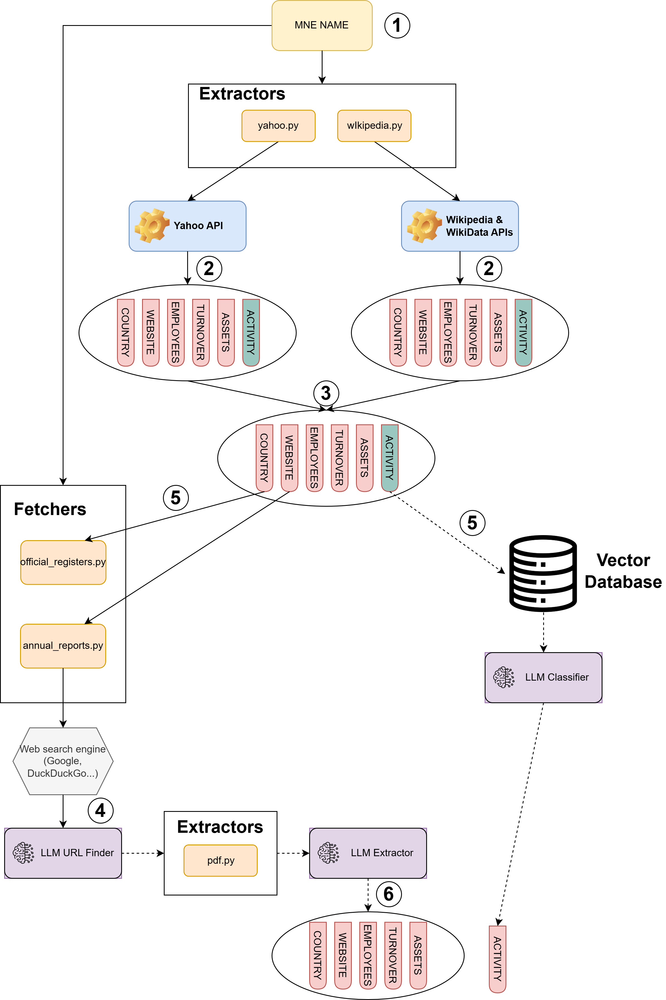

# ESA-MNE Challenge: Multinational Enterprise Profiling Pipeline

This repository implements a complete, modular, and intelligent pipeline to **profile multinational enterprises (MNEs)** using a combination of **public web data**, **PDF extraction**, and **LLM-assisted classification**. It is designed to produce structured data for both the **discovery** and **extraction** challenges of the ESA-MNE competition.

---

## 🚀 Project Overview

The pipeline collects and consolidates data for a set of MNEs using the following sources:

* 🌍 **Wikipedia & Wikidata** — General company information.
* 📉 **Yahoo Finance** — Public financial records and business descriptions.
* 📄 **Annual Reports** — Extracted from PDFs via web search and LLM processing.
* 🏧 **Official Registers** — Governmental registries (e.g., France’s SIREN) for validated activity codes.

The final output includes:

* `discovery_submission.csv` — Provenance of discovered sources.
* `extraction_submission.csv` — Structured company facts: turnover, employees, assets, website, activity and country of headquarters.

> 🔍 **Try It Live**: You can explore this pipeline interactively with the [Multinational Enterprise Explorer App](https://mne-ui.lab.sspcloud.fr/). It's powered by Streamlit and includes search, extraction, and classification steps in real time.

---

## 🧽 Pipeline Architecture



## 📁 Repository Structure

```
└── esa-mne-challenge/
    ├── README.md
    ├── Dockerfile
    ├── LICENSE
    ├── pyproject.toml
    ├── renovate.json
    ├── setup.sh
    ├── uv.lock
    ├── .env
    ├── .pre-commit-config.yaml
    ├── .python-version
    ├── cache/
    ├── data/
    │   ├── discovery/
    │   └── extraction/
    ├── kubernetes/
    ├── src/
    │   ├── app.py                   # Streamlit app to deploy the pipeline
    │   ├── build_vector_db.py       # Script that construct the Vector DB
    │   ├── run_pipeline.py          # Main pipeline orchestration
    │   ├── cache/                   # Local cache for report URLs and tickers
    │   ├── common/                  # Shared utilities for both discovering and extraction challenges
    │   ├── config/                  # Logging, env setup
    │   ├── extractors/              # Source-specific structured data extractors
    │   ├── fetchers/                # Source fetchers
    │   ├── nace_classifier/         # RAG-based NACE classification
    │   └── vector_db/               # Vector DB loading logic
    └── .github/workflows/

```

---

## 🛠️ Setup Instructions

### 1. Environment

```bash
uv sync
```

### 2. Environment Variables

Copy and configure `.env.example`:

```env
OPENAI_API_KEY=your-api-key
```

---

## ▶️ Running the Pipeline

To try the pipeline, the easiest is that you test it via the [App](https://mne-ui.lab.sspcloud.fr/)

If you wish to run the pipeline locally to generate submission files for the challenge, you’ll need to configure Langfuse for LLM trace logging, set up an OpenAI client, and connect to the Qdrant vector database. The simplest way to get started is by using the [**SSPCloud** platform](https://datalab.sspcloud.fr/), and I’d be happy to assist with setup if needed.


To run the pipeline, execute the following command:

```bash
uv python src/run_pipeline.py
```

Results will be saved as:

* `discovery_submission.csv`
* `extraction_submission.csv`

---

## 🔍 Major Components

### 🧠 `WikipediaExtractor`

* Scrapes infobox, Wikidata, and article summary.
* Resolves conflicting info via quality-first arbitration.

### 📉 `YahooExtractor`

* Uses `yfinance` to extract revenue, assets, employees, and activity.
* Normalizes currency and domain names.

### 📄 `AnnualReportFetcher`

* Searches for company PDFs using Google/DDG.
* Validates links and selects final URL using LLM (Langfuse).
* Caches results in `/tmp/cache/reports_cache.json`.

### 📃 `PDFExtractor`

* Extracts specific values (e.g., revenue) from PDF pages via:

  * Keyword-based page selection
  * Langfuse prompt + LLM structuring
  * Country/currency normalization

### 🏧 `OfficialRegisterFetcher`

* Country-specific registry data (e.g., France’s SIREN).
* Retrieves official national IDs and activity codes.

### 🏧 `NACEClassifier`

* Uses a vector database of NACE descriptions (retrieved via `get_vector_db()`).
* Prompt-instructed LLM selects most appropriate NACE code.
* Appends correct section letter using `mapping.json`.

---

## 📄 License

MIT License

---

## 👥 Author

* Thomas Faria

---
